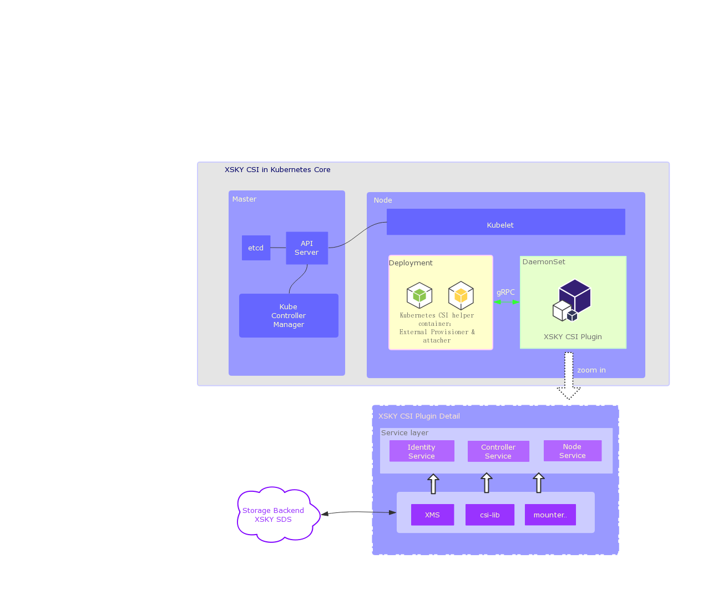

# XSKY CSI Driver


[Container Storage Interface (CSI)](https://github.com/container-storage-interface/) driver, provisioner, and attacher for XSKY ISCSI and NFS.

## Overview

XSKY CSI plugins implement an interface between CSI enabled Container Orchestrator (CO) and XSKY cluster. 
It allows dynamically provisioning XSKY volumes(block or file) and attaching them to workloads. 
Current implementation of XSKY CSI plugins was tested in Kubernetes environment (requires Kubernetes 1.13+) but the code does not rely on any Kubernetes specific calls (WIP to make it k8s agnostic) and should be able to run with any CSI enabled CO.

The architectural of xsky csi driver:



### Implementation

There's three gRPC service as display above which means xsky csi driver can provide
lots of feature base on CSI Spec
For instance: dynamic provisioning, snapshot, volume resize ...

Drivers are containerlized, which means there's no need to concern if those
driver pollute your production environment. They are lightweight containers.
Run it with deployment and daemonset and it is easy to manage.

For details about configuration and deployment of ISCSI or NFS CSI plugins, please refer our documentation.

For example usage of this iSCSI CSI plugins, see examples below.

Before to go,  you should have installed [XSKY SDS](https://www.xsky.com/en/)

Get latest version of XSKY CSI driver at [docker hub](https://hub.docker.com/u/xskydriver) by running:

``` bash
docker pull xskydriver/csi-iscsi
docker pull xskydriver/csi-nfs
```

[Document for XSKY-Block driver](csi-block.html)

[Document for XSKY-EUS driver](csi-fs.html)

