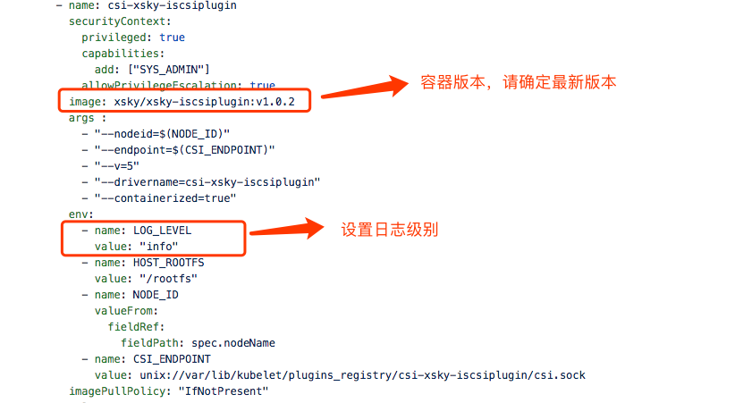
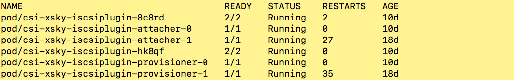
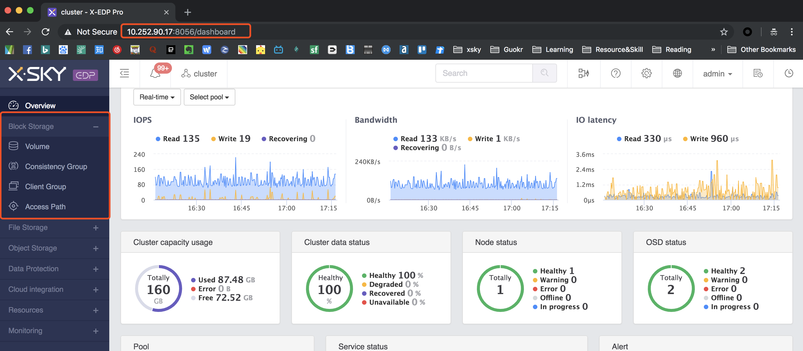
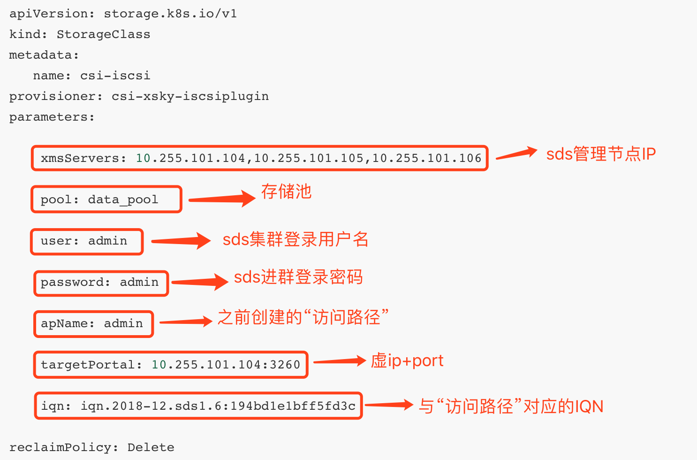
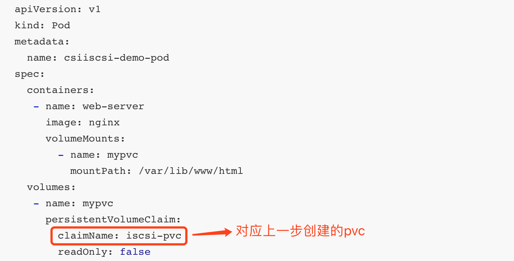

# XSKY CSI plugin for Block Storage 1.0.0

[Home](https://xsky-storage.github.io/xsky-csi-driver/)

## Overview

XSKY CSI plugins implement interfaces of CSI. It allows dynamically provisioning XSKY volumes and attaching them to workloads. Current implementation of XSKY CSI plugins was tested in Kubernetes environment (requires Kubernetes 1.11+), but the code does not rely on any Kubernetes specific calls (WIP to make it k8s agnostic) and should be able to run with any CSI enabled CO.


## Purpose of this article

Provide more details about configuration and deployment of Xsky Block Storage driver
Introduce usage of Xsky Block Storage driver. see examples below.

* [Deployment](#Deployment)
* [Usage](#Usage)

Before to go,  you should have installed [XSKY SDS](https://www.xsky.com/en/)

You can get latest version of XSKY CSI driver at [docker hub](https://hub.docker.com/u/xskydriver) by running `docker pull xskydriver/csi-iscsi`

# Deployment

In this section，you will learn how to deploy the CSI driver and some necessary sidecar containers

## Prepare cluster ##

| Cluster | version |
| ----------| --------------|
| Kubernetes | 1.13 + |
| XSKY SDS | 4.0+          |


## Deploy CSI plugins


### Install dependencies

**Note：install these utils for all kubernetes node**

```bash
yum install binutils iscsi-initiator-utils kmod-xfs xfsprogs
yum install sg3_utils-devel.x86_64 sg3_utils-libs.x86_64 sg3_utils.x86_64
```


### Plugins

#### Get yaml file

Get yaml file from below links：

- [csi-attacher-rbac.yaml](https://xsky-storage.github.io/deploy/iscsi/kubernetes/csi-attacher-rbac.yaml)
- [csi-nodeplugin-rbac.yaml](https://xsky-storage.github.io/deploy/iscsi/kubernetes/csi-nodeplugin-rbac.yaml)
- [csi-provisioner-rbac.yaml](https://xsky-storage.github.io/deploy/iscsi/kubernetes/csi-provisioner-rbac.yaml)
- [csi-xsky-iscsiplugin-attacher.yaml](https://xsky-storage.github.io/deploy/iscsi/kubernetes/csi-xsky-iscsiplugin-attacher.yaml)
- [csi-xsky-iscsiplugin-provisioner.yaml](https://xsky-storage.github.io/deploy/iscsi/kubernetes/csi-xsky-iscsiplugin-provisioner.yaml)
- [csi-xsky-iscsiplugin.yaml](https://xsky-storage.github.io/deploy/iscsi/kubernetes/csi-xsky-iscsiplugin.yaml)


#### Basic remark of iSCSI CSI driver configuration（**csi-xsky-iscsiplugin.yaml**）
Usually, you dotn't need to alter any configurations we provided , but you can still modify this yaml to setup the driver for some situation.


#### deploy sidecar（Helper container）& node plugin

1. Create RABCs for sidecar container and node plugins:

   ```shell
   $ kubectl create -f csi-attacher-rbac.yaml
   $ kubectl create -f csi-provisioner-rbac.yaml
   $ kubectl create -f csi-nodeplugin-rbac.yaml
   ```

2. Deploy CSI sidecar container:

   ```shell
   $ kubectl create -f csi-xsky-iscsiplugin-attacher.yaml
   $ kubectl create -f csi-xsky-iscsiplugin-provisioner.yaml
   ```

3. Deoloy iSCSI CSI driver:

   ```shell
   $ kubectl create -f csi-xsky-iscsiplugin.yaml
   ```

4. To verfify:

   ```shell
   $ kubectl get all
   ```

   

   


Congratulation to you, you have just finished the deployment. Now you can use them to provisioning XSKY block volume .


# Usage

In this section，you will learn how to dynamic provision block volume with XSKY CSI driver. Here will Assumes that you have installed XSKY SDS Cluster.


## Preparation

To continue，make sure you have finish the Deployment part.

Login to you SDS dashboard, your dashboard address should be `http://your_domain.com/8056`




### Access path & vip groups

#### Creating access path，Loading gateway server


#### Config virtual IP group


## Usage

### Edit  yaml for StorageClass

#### sample（storageclass.yaml）

```shell
apiVersion: storage.k8s.io/v1
kind: StorageClass
metadata:
   name: csi-iscsi
provisioner: csi-xsky-iscsiplugin
parameters:

    xmsServers: 10.255.101.104,10.255.101.105,10.255.101.106
    
    pool: data_pool
    
    user: admin
    
    password: admin
    
    apName: admin
    
    targetPortal: 10.255.101.104:3260
    
    iqn: iqn.2018-12.sds1.6:194bd1e1bff5fd3c
    
reclaimPolicy: Delete
```


#### Explanation of StorageClass parameters



#### Creating storageclass

```shell
$ kubectl create -f storageclass.yaml
```


### Edit yaml for PersistentVolumeClaim

#### sample（pvc.yaml）

```shell
apiVersion: v1
kind: PersistentVolumeClaim
metadata:
  name: iscsi-pvc
spec:
  accessModes:
  - ReadWriteOnce
  resources:
    requests:
      storage: 5Gi
  storageClassName: csi-iscsi
```

#### Explanation of pvc.yaml


#### Creating pvc

```shell
$ kubectl create -f pvc.yaml
```


#### Verify

- Run kubectl check command

  ```shell
  $ kebectl get pvc
  ```

  

- Check at SDS dashboard 

  


### Edit yaml for pod

#### sample（pod.yaml）

```shell
apiVersion: v1
kind: Pod
metadata:
  name: csiiscsi-demo-pod
spec:
  containers:
   - name: web-server
     image: nginx 
     volumeMounts:
       - name: mypvc
         mountPath: /var/lib/www/html
  volumes:
   - name: mypvc
     persistentVolumeClaim:
       claimName: iscsi-pvc
       readOnly: false
```

#### Explanation of pod.yaml



#### Creating pod

```shell
$ kubectl create -f pod.yaml
```


#### Verify

- Run kubectl command to get pod

  ```shell
  $ kubectl get pods | grep csiiscsi-demo-pod -o wide
  ```

  

- Check  the container at the node where this pod was scheduled

  


[Home](https://xsky-storage.github.io/xsky-csi-driver/)